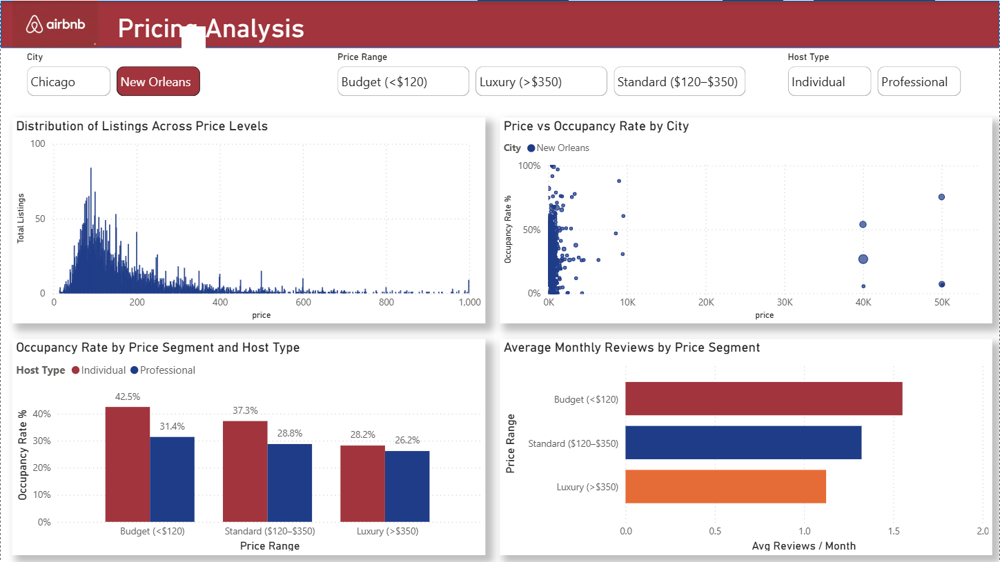

# Airbnb Market Analysis: Chicago vs New Orleans

An end-to-end data analytics project analyzing Airbnb market dynamics across **Chicago** and **New Orleans**, with a focus on market structure, pricing behavior, demand efficiency, and host concentration.

This project was designed to mirror how a **real-world data analyst / BI consultant** would approach a marketplace problem—from raw data cleaning to executive-ready dashboard storytelling.

---

## 📌 Project Objectives

The primary goals of this project were to:

- Understand the **size and activity** of Airbnb markets in two distinct cities
- Analyze **spatial and neighborhood-level supply patterns**
- Examine how **pricing interacts with demand and occupancy**
- Identify **host concentration and professionalization trends**
- Build an **industry-ready Power BI dashboard** suitable for portfolio and interviews

---

## 🗂️ Data Source

Data was sourced from **InsideAirbnb**, using real listing-level datasets for:

- **Chicago**
- **New Orleans**

Each dataset includes information such as:
- Listing price, room type, availability
- Reviews and review frequency
- Host identifiers
- Geographic coordinates (latitude, longitude)
- Neighborhood and location attributes

---

## 🧠 Analytical Framework

The analysis follows a **four-stage framework**, commonly used in marketplace and real estate analytics:

### 1️⃣ Market Overview
**Purpose:** Establish overall market context and city-level comparison.

Key focus areas:
- Total listings and active supply
- Median pricing
- Occupancy rate as a demand proxy
- Room type composition

---

### 2️⃣ Property & Neighborhood Analysis
**Purpose:** Understand *where* supply is concentrated and *how* pricing varies spatially.

Key focus areas:
- Geographic clustering of listings
- Neighborhoods with highest listing concentration
- Neighborhood-level pricing power
- Room type mix across high-supply areas

---

### 3️⃣ Pricing & Demand Analysis
**Purpose:** Analyze demand efficiency and price elasticity.

Key focus areas:
- Price distribution and outliers
- Relationship between nightly price and occupancy
- Demand intensity using reviews per month
- Performance differences across price segments and host types

---

### 4️⃣ Host & Market Structure Analysis
**Purpose:** Examine supply ownership and concentration.

Key focus areas:
- Individual vs professional host dominance
- Distribution of listings per host
- Host scale vs occupancy performance
- Identification of top professional hosts

---

## 🛠️ Tools & Technologies

- **Python** (Pandas, NumPy) — data cleaning and preparation  
- **Power BI** — interactive dashboard design and storytelling  
- **GitHub** — version control and project documentation  

---

## 🔍 Key Insights

Some of the key insights from the analysis include:

- Professional hosts control a **disproportionate share of listings**, despite being fewer in number.
- Higher nightly prices **do not consistently translate into higher occupancy**, indicating diminishing returns at premium price points.
- **Budget and standard-priced listings** achieve stronger demand efficiency across both cities.
- Airbnb supply is **spatially concentrated** in a limited number of neighborhoods, while pricing power varies independently of supply density.
- Increasing host scale does **not guarantee better performance**, suggesting operational or demand-side constraints.

---

## 📊 Dashboard Preview

### Page 1 — Market Overview

### Page 2 — Property & Neighborhood Analysis

### Page 3 — Pricing & Demand Analysis

### Page 4 — Host & Market Structure

---

## ▶️ How to Reproduce

1. Run the notebook in `notebooks/01_data_cleaning.ipynb` to clean and prepare the data.
2. Use the output file in `data/cleaned/` as the data source for Power BI.
3. Open `powerbi/Airbnb_Market_Analysis.pbix` to explore the interactive dashboard.

---

## 📌 Project Takeaway

This project demonstrates a **full analytics lifecycle**:
- From raw data to clean, analysis-ready datasets
- From exploratory analysis to structured insights
- From charts to **clear, business-relevant storytelling**

It reflects how data analysis is applied in **real marketplace, real estate, and platform strategy contexts**.

---

## 👤 Author

**Syed Irshad**  
Aspiring Data Analyst | Business Analytics & Data Science  
